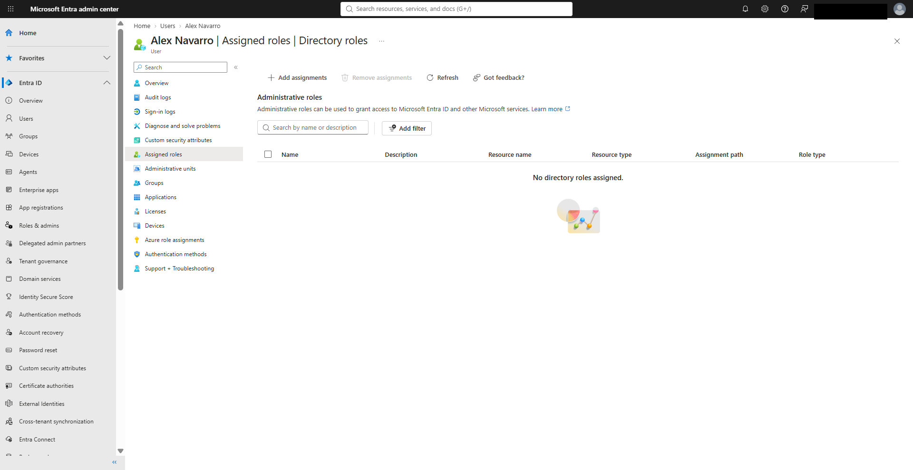
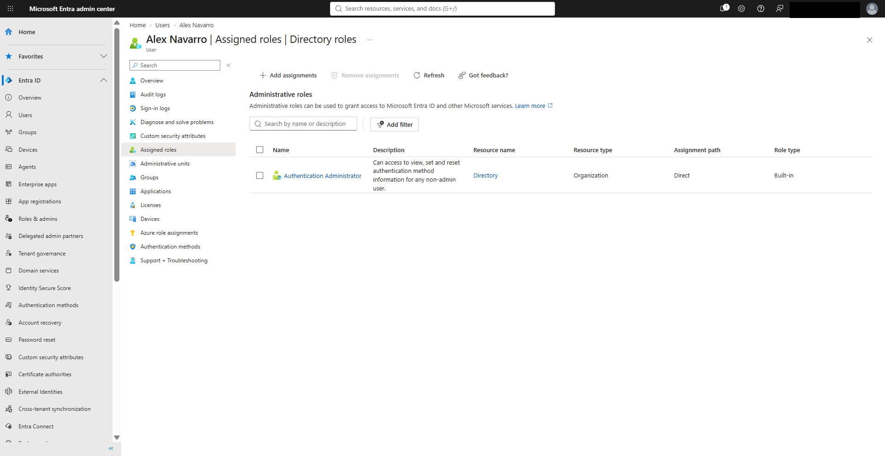
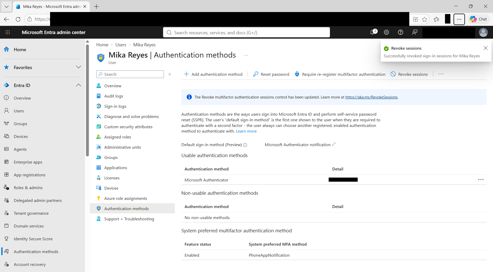
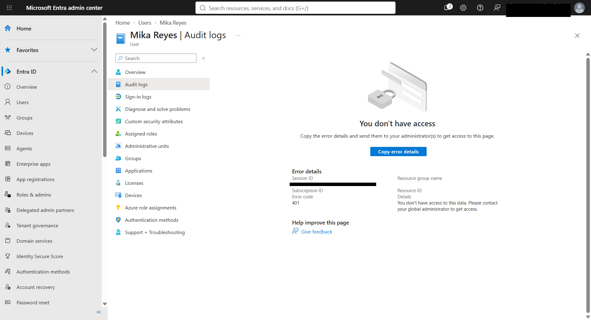
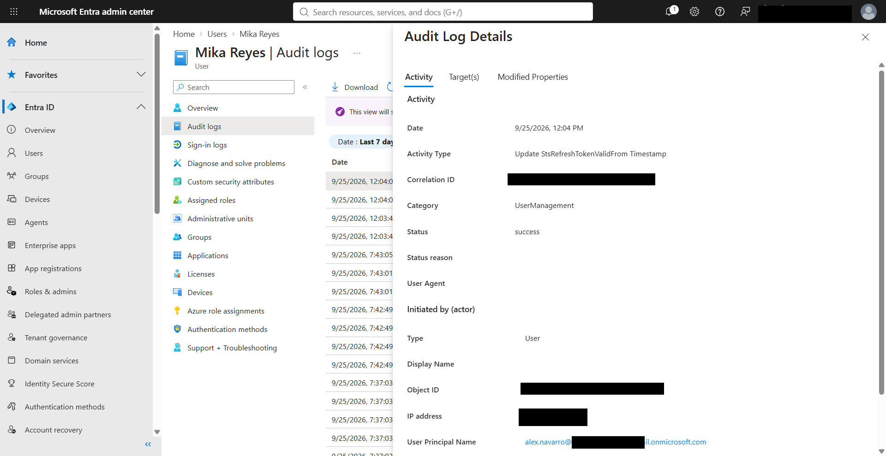
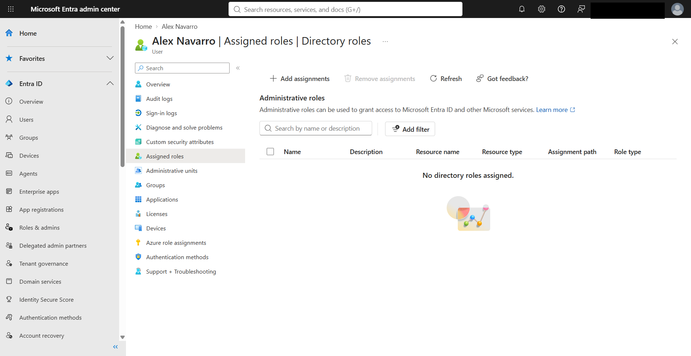

# Microsoft Entra ID RBAC & Least-Privilege Lab

Hands-on Microsoft Entra ID lab demonstrating Role-Based Access Control (RBAC), delegated administration, least-privilege access, authorization boundaries, session revocation, audit verification, and privilege deprovisioning.

## Project Objectives

- Establish a zero-role baseline for a test administrator
- Assign the built-in Authentication Administrator role
- Validate delegated administrative access
- Perform an authorized user authentication-support action
- Verify restricted access outside the delegated role
- Review audit evidence from a Global Administrator account
- Remove elevated access after completing the task
- Confirm return to a zero-role state

## Environment

- Microsoft Entra ID
- Microsoft Entra admin center
- Test users: Alex Navarro and Mika Reyes
- Built-in role: Authentication Administrator
- RBAC and least-privilege testing
- Microsoft Entra audit logs

## Lab Workflow

### 1. Baseline: No Directory Roles

Alex Navarro was verified with no directory roles assigned before delegated access was granted.

### 2. Authentication Administrator Assignment

The built-in Authentication Administrator role was assigned to Alex Navarro.

This role provides delegated capabilities for managing authentication information for supported non-admin users without granting unrestricted tenant administration.

### 3. Authorized Session Revocation

While signed in using the delegated administrator account, Mika Reyes was selected as a non-admin target.

Alex successfully revoked Mika's sign-in sessions through the Authentication Methods management interface.

### 4. Authorization Boundary Validation

The delegated Authentication Administrator account was unable to access Mika's audit logs.

Microsoft Entra returned a 401 access-denied response, confirming that the delegated role did not have permission to view the audit data.

### 5. Global Administrator Audit Verification

A Global Administrator reviewed the audit event generated by the session revocation.

The event showed:

- Category: UserManagement
- Status: Success
- Session-token validity update
- Alex Navarro as the initiating user

### 6. Privilege Deprovisioning

After the administrative task and validation were completed, the Authentication Administrator role was removed from Alex Navarro.

The account returned to a zero-directory-role state.

## Key IAM Concepts Demonstrated

| Concept | Demonstration |
|---|---|
| RBAC | Assigned a specific built-in administrative role |
| Least Privilege | Granted only the permissions needed for authentication support |
| Delegated Administration | Used a limited administrator instead of Global Administrator |
| Authentication vs Authorization | Alex could authenticate but remained restricted from unauthorized resources |
| Session Revocation | Revoked a user's active sign-in sessions |
| Authorization Boundaries | Audit-log access was denied to the delegated administrator |
| Auditability | Administrative activity was independently verified through Entra audit logs |
| Privilege Deprovisioning | Elevated access was removed after the administrative task |

## Security Principles Applied

**Least Privilege**  
Administrative access was limited to the minimum capability required for the task.

**Separation of Duties**  
Authentication support was performed by a delegated administrator, while broader audit visibility remained restricted.

**Accountability**  
Administrative activity was recorded and independently verified using Microsoft Entra audit logs.

**Privilege Lifecycle Management**  
The workflow followed:

`Baseline → Grant → Use → Validate → Audit → Remove`

## Key Takeaway

This lab demonstrates that effective IAM administration is not simply about granting administrator access.

A secure approach requires assigning the appropriate role, validating permitted and restricted actions, maintaining auditability, and removing elevated privileges when they are no longer required.
